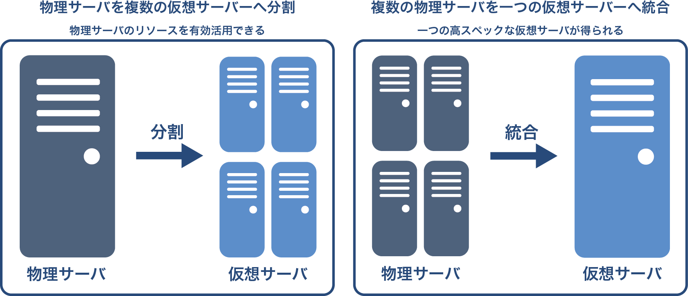
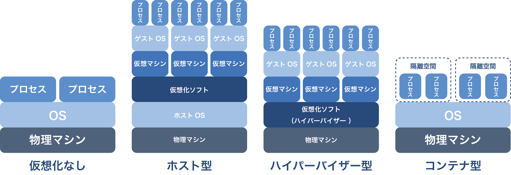

# 第1回：仮想環境の全体像について
  * サーバ仮想化とはなにか？
  * サーバ仮想化の基礎概念
  * サーバ仮想化技術の種類と性能
  * 仮想化のメリット・デメリット
  * 各仮想化技術の用途と導入場所
  * まとめ

##サーバ仮想化とはなにか？
ソフトウェアによって仮想的にコンピュータを構築する技術です。

通常のPCやサーバは様々なハードウェアで構成されています。  
（CPU、ハードディスク、ネットワークカード、グラフィックカードなど）   
サーバ仮想化ではこれらのハードウェアをソフトウェアによって仮想的に作り上げています。

##サーバ仮想化の基礎概念
サーバ仮想化には大きく分けて2つの概念があります。

###分割
1つの物理サーバ上で仮想サーバを動作させることで物理サーバ1台の資源を分割するという意味です。  
サーバリソースを効率的に利用出来るようになります。

###統合
複数の物理サーバを一つの仮想マシンとして動作させることで、複数の物理サーバの資源を統合するという意味です。  
 リソースを統合した分、処理能力の高いサーバとして利用することが出来ます。

#####仮想化の概念図


#####IaaS系のクラウドサービスでは
リソースプールといった資源の統合や資源の分割、ネットワークの仮想化によって柔軟にサーバを切り売りしています。

##サーバ仮想化技術の種類と性能
サーバ仮想化技術には大きく分けてホスト型、ハイパーバイザー型、コンテナ型の3種類があります。

###ホスト型
####特徴
既にインストールされているOS上で、ソフトウェアとして動作させることができます。  
そのため手軽に仮想サーバを構築する事が可能です。  
ただし物理ハードウェアにアクセスするためにホストOSを経由するため、  
その分のオーバーヘッドがかかりハイパーバイザー型やコンテナ型に比べて性能低下が大きいです。
####主なホスト型VM
```
Virtual Box, VMware [Player, WorkStation, Fusion], Parallels Desktop
```

###ハイパーバイザー型
####特徴
物理サーバに直接インストールして動作させます。仮想化モニタや仮想化OSとも呼ばれます。  
ホストOSを経由しない分、性能低下を抑えることが出来ます。  
####主なハイパーバイザー型VM
```
KVM, VMware vSphere(Esxi), XenServer, Hyper-V
```
<strong>※実際にはハイパーバイザーの中にもいくつか種類があります。詳細は第4回で説明します。</strong>

###コンテナ型
####特徴
他2つと違い仮想化のレイヤーが存在しません。  
namespacesやcgroupsなどの技術を利用して領域を区切りユーザープロセスを閉じ込めています。  
仮想化のレイヤーがないため、オーバーヘッドが最も小さいです。  
仮想サーバ上にも導入されるケースがあります。  
AWS,GCE,IDC,さくらVPSなどにも仮想サーバ上でコンテナを利用するプランがあります。  
####主なコンテナ型VM
```
Docker, LXC, Rocket
```
#####仮想化の比較図



##仮想化のメリット・デメリット
###企業視点
####メリット
 * サーバのリソースを有効活用
 * サーバの作成・削除が容易
 * コスト削減（場所代、電気代、ハードウェア代）
 * サーバのスペックアップが容易
 * ライブマイグレーション
```
ライブマイグレーションとは？  
仮想サーバを動作させたまま、別の物理サーバに仮想サーバを移動させる技術です。  
物理サーバのメンテナンス時や、サーバ交換時に有用な技術です。
```

####デメリット
* 物理サーバのダウンによる影響範囲の拡大  
バックアップやホットスタンバイなど適切な準備を行うことで影響を押さえられます。
* 運用管理者の学習コスト

###個人視点
####メリット
* 私用PC上で複数サーバ稼働させられる
* サーバの作成・削除が容易

####デメリット
 特に思いつかないです。むしろVM上で開発したほうが良いです。

##各仮想化技術の用途と導入場所
###ホスト型
主に開発環境で利用されます。  
仮想サーバ自体はファイルとして残るので、メンバー間で開発環境を共有しやすいのが理由です。  
公開サーバを外部IaaSなどを利用しているスタートアップでよく利用されています。  
最近はコンテナ型VMにシェアを奪われてきています。

###ハイパーバイザー型
開発環境、本番環境共に利用されています。  
サーバを自社に保有している場合や、金銭的に余裕のある大企業などを中心に導入されています。  
AWS,GCE,IDC,さくらVPSなどのIaaSサービスで導入されています。  

###コンテナ型
開発環境、本番環境（一部企業）共に利用されています。  
ただ最近表舞台に出てきたこともあり、大規模サーバ郡においてコンテナを効率的に管理するノウハウが少ないです。  
そのため、本番環境で利用しているのはGoogleといった一部の企業となっています。  
世の中の流れはコンテナ型へ向かっています。  
AWS,GCE,IDC,さくらVPSなどのIaaSサービスで導入されています。

##まとめ
* サーバ仮想化はソフトウェアによって仮想的なサーバを構築する技術です。
* サーバ仮想化技術には大きく3つの種類がありそれぞれ、ホスト型、ハイパーバイザー型、コンテナ型。
* どのサーバ仮想化技術も開発・本番で利用することは可能ですが、  
性能や運用管理の関係から本番で利用されるのは主にハイパーバイザー型となっています。  
ただし、コンテナの利用が進んでいるので、今後は本番環境もコンテナが主流になりそうです。