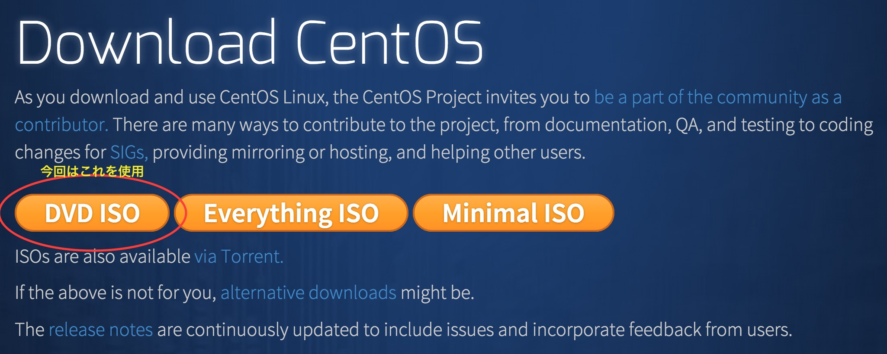
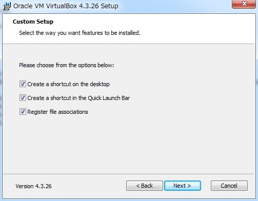

# 第2回：ホスト型VM
* これまでのおさらい
* ホスト型仮想化とは
* VirtualBoxの説明
* VirtualBoxのインストールと設定
* VMの作成
* VM上にCentOSを単純にインストール
* RAID1ミラーリングの説明
* VM上にCentOSをRAID1でインストール
* RAID1のリカバリー作業

## これまでのおさらい
### 第1回：仮想環境の全体像について
* サーバ仮想化とはソフトウェアによって仮想的にコンピュータを構築する技術。  
* サーバ仮想化には3つの種類がある。ホスト型、ハイパーバイザー型、コンテナ型。
```
※広義ではホスト型もハイパーバイザー型も両方ハイパーバイザーと呼ばれるます。
下記のような表記も正しいので混乱しないよう注意してください。
・ホスト型ハイパーバイザー（ホスト型のこと）
・ベアメタル型ハイパーバイザー（ハイパーバイザー型のこと）

ここでは狭義の呼び方で進めます。
```

## ホスト型仮想化とは
ホスト型仮想化技術は、OS上に仮想化ソフトウェアをインストールして、
さらにその上で仮想サーバを動作させる技術です。  
他の仮想化技術に比べると性能面では劣りますが、
サーバや私用PCなどの中で手軽にVMを作成することが出来ます。


## Virtual Boxの説明
innotekによって開発されたホスト型仮想化ソフトです。  
innotekは2008年にサン・マイクロシステムズに買収されたため、  
現在はサン・マイクロシステムズによってメンテナンスがされています。  
ライセンスは：GPL2なので注意しましょう。

## VirtualBoxのインストールと設定
### VirtualBoxのダウンロード  
下記サイトよりダウンロード。  
<a href="https://www.virtualbox.org/wiki/Downloads" target="_blank">Downloads – Oracle VM VirtualBox</a>  


### CentOSのダウンロード  
下記サイトよりダウンロード。  
<a href="https://www.centos.org/download/" target="_blank">Download CentOS</a>  


```
CPUが仮想化支援機能(VT-x,AMD-V)に対応していない場合は、Virtual Boxで64bit版OSを使うことができません。
その場合は32bit版OSを使いましょう。

```
> ##### ハードウェア・エミュレーション
> VirtualBoxは、ハードウェアによる仮想化支援機能として、VT-x（インテル）と、AMD-V（AMD）への対応を含む。対応当初はデフォルトでどちらも有効となっていなかったが[14]、現在のバージョンで提供される機能の一部<span style="color:red">（x86_64対応、マルチコア対応）には、これらの仮想化支援機能を必要とするものがある。</span>  
<a href="http://ja.wikipedia.org/wiki/VirtualBox#.E3.83.8F.E3.83.BC.E3.83.89.E3.82.A6.E3.82.A7.E3.82.A2.E3.83.BB.E3.82.A8.E3.83.9F.E3.83.A5.E3.83.AC.E3.83.BC.E3.82.B7.E3.83.A7.E3.83.B3" target="_blank">VirtualBox - Wikipedia</a> 

### インストール
#### Macの場合
2015/04現在では全てデフォルトのままインストールで大丈夫です。  

1
2
3  
4
5
6

#### Windowsの場合
こちらも2015/04現在では全てデフォルトのままインストールで大丈夫です。  
画像6で「"Oracle Corporation" からのソフトウェア を常に信頼する」にチェックを入れると  
少しインストールが楽になります。  

1
2
3  
4
5
6  
7

### 設定  


## VMの作成
### HDDの種類と説明
### ネットワークの種類と説明
## VM上にCentOSを単純にインストール
## VM上にCentOSをRAID1でインストール
### RAID1ミラーリングの説明
### RAID1のリカバリー作業