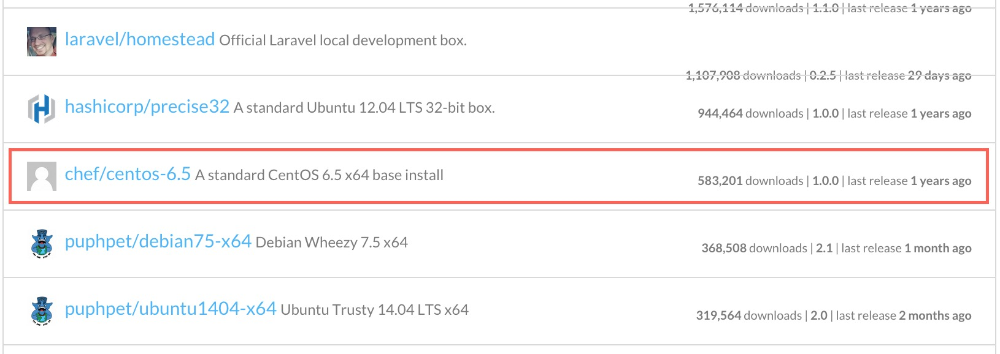

# 第3回：Vagrant
* これまでのおさらい
* Vagrantの概要説明
* 準備とインストール
* 既存のboxから起動
* Vagrantfileについて
* 既存のboxに手を加えてboxを再生成
* Vagrantfileでのプロビジョニング
* webサーバとdbサーバを同時に作成、起動する
* 今回使ったコマンドまとめ


## これまでのおさらい
### 第1回：仮想環境の全体像について
* サーバ仮想化とはソフトウェアによって仮想的にコンピュータを構築する技術。  
* サーバ仮想化には3つの種類がある。ホスト型、ハイパーバイザー型、コンテナ型。

### 第2回：ホスト型仮想化
* ホスト型の仮想化とはホストOS上で動作する仮想化環境。
* ハードウェアアクセスにホストOSを経由するため、オーバーヘッドが大きい。
* ただし手軽に利用できるので一般的に開発機として利用されている。

その他一通りの動作デモを行いました。

### 今回
Vagrantの概要と使いかたを説明。

## Vagrantの概要説明

### 概要
> 仮想環境の雛形を作成し、どこでも簡単に同じ環境を再現できるようにするソフトウェア。  
> <a href="http://e-words.jp/w/Vagrant.html" target="_blank">http://e-words.jp/w/Vagrant.html</a>

`Vagrantではこの雛形のことをboxといいます。`

<p style="color:red">ここに図を挿入</p>

プロバイダ<sup>※1</sup>のフロントエンドとして動作します。  
プロバイダとして下記のものを選択できます。

|         ホスト型         | IaaS(ハイパーバイザー利用) |                       コンテナ型                        |
| ------------------------ | -------------------------- | ------------------------------------------------------- |
| VirtualBox ※これがデフォ | Amazon Web Service         | Docker<br>※裏ではホスト型仮想環境の上で動かしています。 |
| VMware Fusion            | Rackspace Cloud            |                                                         |

今回はデフォルトのVirtual Boxで試していきます。

`※1 Vagrantでは、仮想化環境を提供するバックエンドをプロバイダと呼んでいます。 ` 

### 何がうれしいの？VirtualBoxだけでよくない？
VirtualBoxだけでもVMを用意できますが、下記の点で導入の利点があります。

* boxを利用すれば、OSを一からインストールする必要がない。 
* 構成管理ツールと連携して環境構築の自動化ができる。

<strong>つまり</strong>  
ホストOSに依存しない同一の開発環境を、簡単に他の人と共有できます！
<p style="color:red">ここに図を挿入</p>

<strong>さらに</strong>  
AtlasというHashiCorp社のサービスを利用すれば自動的に本番サーバーへデプロイもできちゃいます。

## 準備とインストール
```
VirtualBox がすでに導入されている前提で進めます。
まだインストールが終わっていない場合は、ダウンロードしてインストールを行ってください。
2015/04現在ではMac, Windowsともにデフォルト設定で問題ありません。
```

### 必要なものを取得
下記サイトよりVagrantをダウンロード  
<a href="https://www.vagrantup.com/downloads.html" target="_blank">https://www.vagrantup.com/downloads.html</a>  

Windowsの場合は下記サイトから Git for Windows をダウンロード  
<a href="https://msysgit.github.io/" target="_blank">https://msysgit.github.io/</a>  

### インストール
#### Macの場合
##### Vagrantのインストール
1. ダウンロードしたdmgファイルを起動  
2. インストーラーに従ってインストール  
（2015/04現在では全てデフォルトでインストールしてOK）

1
2
3  
4

#### Windowsの場合
```
Vagrantを使うにはUnixライクなシェルがあったほうが便利です。  
しかしWindowsには標準でUnixライクなシェルが備わっていません。  
 Git for Windows をインストールすると、手軽にUnixライクなシェルが手に入るので、先にこちらを導入します。
```
##### Git for Windows のインストール  
1. ダウンロードしたexeファイルを起動
2. インストーラーに従ってインストール  
今回は2箇所だけデフォルトから変更します。  
「画像4で On the Desktop にチェック」「画像6で2番目を選択」
3. 日本語の文字化けを修正  
下記サイトを参照   
<a href="http://qiita.com/kumazo@github/items/2169e1ee7be278f82b94" target="_blank">msysgit で日本語を使いたい - Qiita</a>


1
2
3  
4
5
6  
7
8

##### Vagrantのインストール
1. ダウンロードしたmsiファイルを起動
2. インストーラーに従ってインストール  
（2015/04現在では全てデフォルトでインストールしてOK）

1
2
3  
4
5
6

## 既存のboxから起動
### boxとは？
OSが予めインストールされた、仮想マシンのイメージファイルです。  
Vagrantではboxをテンプレートとして、いくつもの仮想マシンを作成できます。

### 実際に起動してみる
##### プロジェクトフォルダの作成
適当にプロジェクトフォルダを作成していきます。  
```bash
$ mkdir -p ~/vagrant/centos6/ && cd ~/vagrant/centos6/
```

##### 使用するboxを選定
Vagrantを開発した企業（HashiCorp）がboxの公開リポジトリを提供しています。
公開リポジトリにアクセスして使いたいboxを探します。   
<a href="https://atlas.hashicorp.com/boxes/search" target="_blank">https://atlas.hashicorp.com/boxes/search</a>   
今回はChef社が作成したCentOSのboxを利用します。<sup>※2</sup>（"chef/centos-6.5"というbox名を後ほど使います。）
  
```
※2
「第2回：ホスト型仮想化」でも説明しましたが、VirtualBoxで64bit版OSを使うには、CPUが仮想化支援機能に対応している必要があります。
VagrantのプロバイダにVirtualBoxを利用した場合、自ずとこの制約を受けます。
仮想化支援機能に対応していない場合は、32bit版OSが格納されているBoxを利用してください。（i386とかx32となっているBox）
```

##### boxをローカルにダウンロード
```bash
$ vagrant box add chef/centos-6.5
==> box: Loading metadata for box 'chef/centos-6.5'
    box: URL: https://atlas.hashicorp.com/chef/centos-6.5
This box can work with multiple providers! The providers that it
can work with are listed below. Please review the list and choose
the provider you will be working with.

1) virtualbox
2) vmware_desktop

Enter your choice: 1
==> box: Adding box 'chef/centos-6.5' (v1.0.0) for provider: virtualbox
    box: Downloading: https://vagrantcloud.com/chef/boxes/centos-6.5/versions/1.0.0/providers/virtualbox.box
==> box: Box download is resuming from prior download progress
==> box: Successfully added box 'chef/centos-6.5' (v1.0.0) for 'virtualbox'!
```

##### 仮想マシンの設定ファイルを作成
Vagrantfileを作成する（Vagrantfileについては後ほど説明します。）  
```bash
$ vagrant init chef/centos-6.5 
A `Vagrantfile` has been placed in this directory. You are now
ready to `vagrant up` your first virtual environment! Please read
the comments in the Vagrantfile as well as documentation on
`vagrantup.com` for more information on using Vagrant.
```

##### 仮想マシンの起動・接続・停止
1.　仮想マシンを起動する。
```bash
$ vagrant up
Bringing machine 'default' up with 'virtualbox' provider...
==> default: Importing base box 'chef/centos-6.5'...
==> default: Matching MAC address for NAT networking...
==> default: Checking if box 'chef/centos-6.5' is up to date...
==> default: Setting the name of the VM: centos6_default_1429363408873_45357
==> default: Clearing any previously set network interfaces...
==> default: Preparing network interfaces based on configuration...
    default: Adapter 1: nat
==> default: Forwarding ports...
    default: 22 => 2222 (adapter 1)
==> default: Booting VM...
==> default: Waiting for machine to boot. This may take a few minutes...
    default: SSH address: 127.0.0.1:2222
    default: SSH username: vagrant
    default: SSH auth method: private key
    default: Warning: Connection timeout. Retrying...
    default: 
    default: Vagrant insecure key detected. Vagrant will automatically replace
    default: this with a newly generated keypair for better security.
    default: 
    default: Inserting generated public key within guest...
    default: Removing insecure key from the guest if its present...
    default: Key inserted! Disconnecting and reconnecting using new SSH key...
==> default: Machine booted and ready!
==> default: Checking for guest additions in VM...
==> default: Mounting shared folders...
    default: /vagrant => /Users/shota/vagrant/centos6
```

2.　仮想マシンのステータスを確認します。
```bash
$ vagrant status
Current machine states:

default                   running (virtualbox)

The VM is running. To stop this VM, you can run `vagrant halt` to
shut it down forcefully, or you can run `vagrant suspend` to simply
suspend the virtual machine. In either case, to restart it again,
simply run `vagrant up`.
```

3.　仮想マシンにアクセスします。
```bash
$ vagrant ssh
```

4.　仮想マシンを出ます。
```bash
[vagrant@localhost ~]$ exit
```

5.　仮想マシンを停止します。
```bash
$ vagrant halt
==> default: Attempting graceful shutdown of VM...
```

##### 仮想マシンの削除
仮想マシンがいらなくなったら削除します。
```bash
$ vagrant destroy
    default: Are you sure you want to destroy the 'default' VM? [y/N] y
==> default: Destroying VM and associated drives...

```

## Vagrantfileについて
### Vagrantfileとは？
> Vagrantfileの主要機能は、プロジェクトに必要なマシンタイプ、 そして、これらのマシンをどのように設定/プロビジョンするかを記述することです。  
<a href="http://lab.raqda.com/vagrant/vagrantfile/index.html" target="_blank">http://lab.raqda.com/vagrant/vagrantfile/index.html</a>   

<p style="color:red">ここに図を挿入</p>

### Vagrantfileの設定項目（元から中に記述されている項目のみ）

|                      設定項目                     |                                                説明                                               |
| ------------------------------------------------- | ------------------------------------------------------------------------------------------------- |
| Vagrant.configure("2") do &#124;config&#124;      | Vagrantfileの記述フォーマットを指定します。                                                       |
| config.vm.box                                     | 利用するboxを指定します。                                                                         |
| config.vm.box_check_update                        | 利用しているboxがアップデートされた時に通知されます。<br>通知のタイミングはvagrant upした時です。 |
| config.vm.network "forwarded_port"                | ホストマシンへのアクセスを、ゲストマシンへ転送します。<br>例）guest: 80, host: 8080 の場合<br>ホストの8080へアクセスがあったら、ゲストの80へ転送します。 |
| config.vm.network "private_network"               | ゲストマシンにIPアドレスを割り振ります。<br>ホストマシンの外部から直接このIPへ接続はできません。  |
| config.vm.network "public_network"                | ゲストマシンにIPアドレスを割り振ります。<br>ホストマシンの外部から直接このIPへ接続できます。      |
| config.vm.synced_folder                           | ホストマシンのフォルダとゲストマシンのフォルダを同期します。<sup>*1</sup>                         |
| config.vm.provider "virtualbox" do &#124;vb&#124; | 使用するプロバイダを指定して、設定用に別名をつけます。<br>ここではVirtualBox利用。                |
| vb.gui                                            | VirtualBoxのディスプレイも一緒に立ち上げます。（VirtualBox用設定。）                              |
| vb.memory                                         | ゲストマシンのメモリを設定します。（VirtualBox用設定。）<br>1GBを設定する場合は次のように指定します。vb.memory = "1024" |
| config.push.define                                | vagrant push <sup>*2</sup>の設定をします。                                                        |
| config.vm.provision                               | プロビジョニングの設定を行います。                                                                |

```
*1
これを指定しなくてもホストのプロジェクトディレクトリ（Vagrantfileがあるディレクトリ）と
ゲストの /vagrant はデフォルトで同期されています。

*2
vagrant push はソースコードをサーバーへ送るコマンドです。
プロジェクトディレクトリ（Vagrantfileがあるディレクトリ）配下のソースコードがpush対象となります。
atlas、HerokuといったサービスやFTPサーバーへ送ることができます。
```

## 既存のboxに手を加えてboxを再生成
Vagrantではboxから作成した仮想サーバを、再度boxとして出力することができます。  
この機能を利用すれば、自分独自の設定を反映したboxを作成できます。  
試しにapache(webサーバ)を導入してboxに固めてみましょう。

### boxの再生成
1.　プロジェクトフォルダの作成とVagrantfileの生成
```bash
$ mkdir -p ~/vagrant/webserver && cd ~/vagrant/webserver
$ vagrant init chef/centos-6.5
```

2.　Vagrantfileの一部修正
```bash
# Webサーバのアクセス用にプライベートの固定IPアドレスを付与
$ vim Vagrantfile
    # config.vm.network "private_network", ip: "192.168.33.10" を追記
```

3.　仮想サーバでにログインして導入作業
```bash
$ vagrant up
$ vagrant ssh

# SELinuxをオフ
[vagrant@localhost ~]$ sudo setenforce 0

# SELinuxを永続的にオフ（SELINUX=permissive を SELINUX=disabled へ）
[vagrant@localhost ~]$ sudo vi /etc/selinux/config

# MACアドレスとネットワークインターフェースのマッピング固定を無効化
[vagrant@localhost ~]$ sudo ln -s -f /dev/null /etc/udev/rules.d/70-persistent-net.rules

# apacheをインストール
[vagrant@localhost ~]$ sudo yum -y install httpd

# httpd.confに ServerName localhost:80 を追加（検証環境なので、横着してlocalhost・・・）
[vagrant@localhost ~]$ sudo vi /etc/httpd/conf/httpd.conf

# apacheをスタート
[vagrant@localhost ~]$ sudo service httpd start
Starting httpd:                                            [  OK  ]

# apacheを自動起動登録
[vagrant@localhost ~]$ sudo chkconfig httpd on

[vagrant@localhost ~]$ exit
```

4.　webブラウザでアクセスして画面が表示されることを確認  
<a href="http://192.168.33.10" target="_blank">http://192.168.33.10</a>  

5.　仮想サーバを停止
```bash
$ vagrant halt
```

6.　boxを再生成
```bash
$ vagrant package
==> default: Clearing any previously set forwarded ports...
==> default: Exporting VM...
==> default: Compressing package to: /Users/shota/vagrant/webserver/package.box

# apacheを導入したboxが生成されました。
$ ls
Vagrantfile  package.box
```

### package.boxをリストに追加する
```bash
# 追加の名前は自由。こではchef/centos-customとします。
$ vagrant box add chef/centos-custom package.box 
==> box: Adding box 'chef/centos-custom' (v0) for provider: 
    box: Downloading: file:///Users/shota/vagrant/webserver/package.box
==> box: Successfully added box 'chef/centos-custom' (v0) for 'virtualbox'!

# 追加されたことを確認
$ vagrant box list
chef/centos-6.5      (virtualbox, 1.0.0)
chef/centos-custom   (virtualbox, 0)    # 追加されました！
coreos-alpha         (virtualbox, 472.0.0)
```

### 生成したboxから仮想サーバを立ち上げてみる
```bash
$ mkdir -p ~/vagrant/webserver2 && cd ~/vagrant/webserver2
$ vagrant init chef/centos-custom
$ vim Vagrantfile
    # config.vm.network "private_network", ip: "192.168.33.11" を追加
$ vagrant up
```

接続できるか確認  
<a href="http://192.168.33.10" target="_blank">http://192.168.33.11</a> 

これでいくつでもWebサーバを複製できるようになりました。  

### 補足

他の人とboxの共有を想定しているなら、汎用的に利用できる環境構築にとどめるべきです。  
理由としては下記の2点が挙げられます。  

* アプリケーションをインストールした分、box自体のイメージサイズが大きくなるので共有しづらくなる。  
* boxは仮想サーバーのベースとなるものなので、独自の設定がされていると利用シーンが限られてしまう。  

一般的には、細かい設定はプロビジョニングツールで行います。  

## Vagrantfileでのプロビジョニング
Vagrantではサーバの構築にプロビジョニングツールを利用することができます。  
ここでのプロビジョニングはサーバ・プロビジョニングを指すこととします。
> サーバ・プロビジョニング  
> 利用可能なサーバ群（サーバファーム）からサーバを選び出し、適切なソフトウェア（オペレーティングシステム、デバイスドライバ、ミドルウェア、アプリケーションソフトウェア）をロードし、システムを適切に設定したり、サーバ固有の設定（IPアドレスなど）をしたり、といった作業をサーバ・プロビジョニングと呼ぶ。  
> <a href="http://ja.wikipedia.org/wiki/プロビジョニング#.E3.82.B5.E3.83.BC.E3.83.90.E3.83.BB.E3.83.97.E3.83.AD.E3.83.93.E3.82.B8.E3.83.A7.E3.83.8B.E3.83.B3.E3.82.B0" target="_blank">プロビジョニング - Wikipedia</a> 

要はサーバ構築の自動化ができます。

Vagrantがサポートしているプロビジョニングツールは下記です。（参考：
<a href="http://docs.vagrantup.com/v2/provisioning/index.html" target="_blank">公式ドキュメント - Provisioning</a> ）

|  一覧表   |      -       |      -       |     -      |
| --------- | ------------ | ------------ | ---------- |
| Shell     | Ansible      | CFEngine     |            |
| Chef Solo | Chef Zero    | Chef Client  | Chef Apply |
| Docker    | Puppet Apply | Puppet Agent | Salt       |

この他にもプラグインの導入でFabricといったプロビジョニングツールも利用できます。

今回はShellとAnsibleを例に、一つ前の項目で行ったHTMLサーバの構築を自動化してみます。

### Shellでのプロビジョニング
シェルスクリプトを元にプロビジョニングを行います。  
シェルコマンドを元に環境構築ができるので、最も敷居の低いプロビジョニングと言えます。

1.　Vagrantにスクリプトを直接記述してみます。  
　　下記で囲まれば部分にシェルスクリプトを記述すると、初回のvagrant up時に実行してくれます。  
　　※ 再度実行する場合は起動中の仮想マシンに`vagrant provision`を実行します。
```
config.vm.provision "shell", inline: <<-SHELL
# ここに記述
SHELL
```
```bash
$ vim Vagrantfile

#--Vagrantfile---------#

# vagrantのプロビジョニングはroot権限で実行されるためsudoは不要です。

# 解説
# 1. SELinuxをオフ
# 2. SELinuxを永続的に無効化
# 3. MACアドレスとネットワークインターフェースのマッピング固定を無効化
# 4. apacheをインストール
# 5. apacheの設定ファイルにServerNameを追加
# 6. apacheをスタート
# 7. apacheを自動起動に登録

config.vm.provision "shell", inline: <<-SHELL
  setenforce 0
  sed -ie "s/SELINUX\=permissive/SELINUX\=disabled/" /etc/selinux/config
  ln -s -f /dev/null /etc/udev/rules.d/70-persistent-net.rules
  yum -y install httpd
  INSERT_NUMBER=`grep -n "^#ServerName www.example.com:80" /etc/httpd/conf/httpd.conf | cut -d: -f1`
  sudo sed -ie "${INSERT_NUMBER}a ServerName localhost:80" /etc/httpd/conf/httpd.conf
  service httpd start
  chkconfig httpd on
SHELL

#--Vagrantfile/end-----#
```

2.　続いてVagrantfileにアクセス用のIPアドレスを設定しておきます。
```bash
$ vim Vagrantfile
    # config.vm.network "private_network", ip: "192.168.33.12" を追加
```

3.　仮想マシンを起動してみます。
```
$ vagrant up
```

プロビジョニングの途中で赤文字で下記のような警告が出ますが、  
GPG認証の公開鍵をインポートして良いか？という警告のため問題ありません。yum を使用した初回のみ表示されます。
```
==> default: warning: 
==> default: rpmts_HdrFromFdno: Header V3 RSA/SHA1 Signature, key ID c105b9de: NOKEY
==> default: Retrieving key from file:///etc/pki/rpm-gpg/RPM-GPG-KEY-CentOS-6
==> default: Importing GPG key 0xC105B9DE:
==> default:  Userid : CentOS-6 Key (CentOS 6 Official Signing Key) <centos-6-key@centos.org>
==> default:  Package: centos-release-6-5.el6.centos.11.1.x86_64 (@anaconda-CentOS-201311272149.x86_64/6.5)
==> default:  From   : /etc/pki/rpm-gpg/RPM-GPG-KEY-CentOS-6
```
<a href="http://itpro.nikkeibp.co.jp/article/Keyword/20091204/341579/" target="_blank">Linuxキーワード - GPGキー：ITpro</a>

4.　仮想マシンにアクセスしてみます。

<a href="http://192.168.33.12" target="_blank">http://192.168.33.12</a> 


これで、このVagrantfileを共有すれば、だれでも同じ環境を整えられるようになりました。

## webサーバとdbサーバを同時に作成、起動する
下記をVagrantfileに追加して、Vagrant up するとサーバーが同時に2台起動します。
```
config.vm.define :web do |web|
  web.vm.hostname="web"
  web.vm.network :private_network, ip:"192.168.33.11"
end 
config.vm.define :db do |db|
  db.vm.hostname="db"
  db.vm.network :private_network, ip:"192.168.33.12"
end 
```

## 今回使ったコマンドまとめ
|           コマンド           |           意味          |               例                |
| ---------------------------- | ----------------------- | ------------------------------- |
| vagrant box add &lt;NAME&gt; | boxをローカルに追加する | vagrant box add chef/centos-6.5 |
| vagrant init &lt;NAME&gt;    | Vagrantfileを作成       | vagrant init chef/centos-6.5    |
| vagrant up                   | 仮想マシンを立ち上げ    |                                 |
| vagrant status               | 仮想マシンの状態を確認  |                                 |
| vagrant ssh                  | 仮想マシンに接続        |                                 |
| vagrant halt                 | 仮想マシンを停止        |                                 |
| vagrant destroy              | 仮想マシンを削除        |                                 |
| vagrant reload               | 仮想マシンを再起動      |                                 |


## Atlasについて
別の機会に使ってみてレポートします。  
本番環境への自動デプロイや、確認用の一時的な公開サーバを立てたりといろいろ便利機能があるようです。  


## ドキュメント
本家：<a href="https://docs.vagrantup.com/v2/" target="_blank">https://docs.vagrantup.com/v2/</a>   
翻訳：<a href="http://lab.raqda.com/vagrant/" target="_blank">http://lab.raqda.com/vagrant/</a>