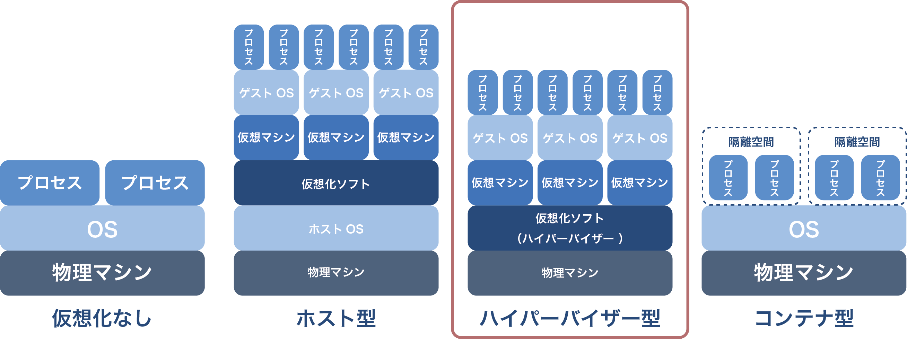

# 第4回：ハイパーバイザー型VM
* これまでのおさらい
* ハイパーバイザー型VMとは？
* KVMの説明
* KVMのインストールと設定


## これまでのおさらい
### 第1回：仮想環境の全体像について
* サーバ仮想化とはソフトウェアによって仮想的にコンピュータを構築する技術。  
* サーバ仮想化には3つの種類がある。ホスト型、ハイパーバイザー型、コンテナ型。
```
※広義ではホスト型もハイパーバイザー型も両方ハイパーバイザーと呼ばれるます。
下記のような表記も正しいので混乱しないよう注意してください。
・ホスト型ハイパーバイザー（ホスト型のこと）
・ベアメタル型ハイパーバイザー（ハイパーバイザー型のこと）

ここでは狭義の呼び方で進めます。
```

### 第2回：ホスト型仮想化
* ホスト型の仮想化ソフトはホストOS上で動作する。
* ハードウェアアクセスにホストOSを経由するため、オーバーヘッドが大きい。
* ただし手軽に利用できるので、一般的に開発機として利用されている。

その他一通りの動作デモを行いました。

### 第3回：Vagrant
* Vagrantは、Virtual Boxなどの仮想化ソフトのフロントエンドツール。
* Vagrantを使えば、仮想環境を手軽に作成することができる。
* プロビジョンビングツールとの連携もできる。

その他一通りの動作デモを行いました。

### 今回
ハイパーバイザーの説明とKVMの使い方を説明（デモなし）

## ハイパーバイザー型VMとは？
### ハイパーバイザー型
ハイパーバイザー型はハードウェア上で直接動作する仮想環境です。  
ホストOSを必要としないため、その分オーバーヘッドが小さい特徴があります。  
仮想環境を提供するOSという意味で、仮想化OSなどとも呼ばれています。  



ハイパーバイザー型は全て同じ形式ではなく、種類と実装方法で下記に分かれています。  

##### 仮想化の種類

* 完全仮想化
* 準仮想化

##### 実装方法

* モノリシックカーネル
* マイクロカーネル

これらを順次説明していきます。

### 仮想化の種類
#### 完全仮想化
ゲストOSに手を加えない仮想化です。  
ゲストOSは仮想環境の上で実行されていると知りません。  
ゲストOSは特権レベルの命令（システムコールなど）をそのまま実行しようとします。それをCPUの仮想化支援機能で判定してハイパーバイザーに実行させます。  
CPUの仮想化支援機能を利用するため、intelのCPUは(VT-x)、AMDのCPUは(AMD-V)に対応している必要があります。  
一般的に準仮想化に比べると速度面で劣ります。  
<span style="color:red">ここにざっくり図</span>

#### 準仮想化
ゲストOSに手を加える仮想化です。  
ゲストOSは仮想環境の上で実行されていことを知っています。  
ゲストOSは特権レベルの命令（システムコールなど）については、自身で実行するのではなくハイパーバイザーに実行を依頼します。  
<span style="color:red">ここにざっくり図</span>

#### 完全仮想化と準仮想化の仕組み（興味ある人だけ）
* <a href="http://thinkit.co.jp/article/125/1/" target="_blank">第1回 CPUの仮想化 | Think IT（シンクイット）</a>  
* <a href="http://ja.wikipedia.org/wiki/%E3%83%AA%E3%83%B3%E3%82%B0%E3%83%97%E3%83%AD%E3%83%86%E3%82%AF%E3%82%B7%E3%83%A7%E3%83%B3" target="_blank">リングプロテクション - Wikipedia</a>  
* <a href="http://www.itmedia.co.jp/enterprise/articles/0612/16/news011.html" target="_blank">1日5分のXen理解：仮想マシンモニタXenの特徴 - ITmedia エンタープライズ</a> 
* <a href="http://japan.zdnet.com/article/35006289/" target="_blank">KVMの機能とクラウドOS：KVM徹底解説 第2回 - ZDNet Japan</a>  
* <a href="http://itpro.nikkeibp.co.jp/article/lecture/20061228/258010/" target="_blank">仮想化技術を学ぶ - 仮想化技術を学ぶ：ITpro</a>  
* <a href="http://www.atmarkit.co.jp/fwin2k/tutor/intelvtx/intelvtx_01.html" target="_blank">仮想化技術の性能を向上させる、ハードウェア仮想化支援機能とは？ － ＠IT</a>

#### 準仮想化と完全仮想化の比較表
わかりやすい比較表があったので引用します。  
（引用元：<a href="https://blogs.oracle.com/dbjp/entry/virtual_000103" target="_blank">Oracle VM 仮想化の心得 サーバー仮想化の基礎から学ぶOracle VM実践導入ガイド</a>）

|                        | 準仮想化 | 完全仮想化 |
| ---------------------- | -------- | ---------- |
| **使用可能な<br>ゲストOS** | Linux系のみ<br>（ただし、サポート対象はOEL、RHELのみ） | 制限なし<br>（ただしサポート対象はOracle Enterprise Linux、<br>RHELおよびWindows系のみ）|
| **主なメリット**       | ハイパフォーマンス | ●ゲストOSがそのまま使える<br>●通常HWとの互換性が高い |
| **デメリット**         | OS（カーネル）に変更を加える必要あり | I/O関連のパフォーマンスが落ちる<br>（ただし、パラバーチャルドライバを入れることにより<br>I/O 関連の処理を効率化するためパフォーマンスアップ）|
| **そのほかの<br>制限事項** | －  | 仮想化支援機能をサポートするCPU<br>（Intel VT、 AMD-V) が必須 |


### 実装方法
#### モノリシックカーネル
ハイパーバイザーの中にデバイスドライバを含んだ実装です。  
全てをハイパーバイザーの中で制御できるので、一般的に実行速度が速いです。  
ただ、デバイスドライバをハイパーバイザー内に含んでおかなければいけないので、  
サポート対応が大変です。  
<span style="color:red">ここに図</span>

#### マイクロカーネル
マイクロカーネル実装のハイパーバイザーは、自身とは別に管理OSを必要とします。  
ハードウェアにアクセスするときは管理OSを経由するので、デバイスドライバは管理OSのものを利用できます。  
管理OSと連携する必要があるので、一般的に実行速度はモノリシックカーネル実装に劣ります。  
<span style="color:red">ここに図</span>

#### モノリシックカーネルとマイクロカーネルの比較表
|                |                 モノリシックカーネル                 |                     マイクロカーネル                     |
| -------------- | ---------------------------------------------------- | -------------------------------------------------------- |
| **メリット**   | ハイパフォーマンス                                   | 管理OS(WindowsやLinux)の<br>デバイスドライバを流用できる |
| **デメリット** | デバイスドライバ対応が<br>ハイパーバイザー開発元次第 | 管理OSが必要<br>（管理OS分のリソース消費）               |

### 各仮想化OSの種類と実装方法
|       仮想化OS       |                  仮想化の種類                 |       実装方法       |
| -------------------- | --------------------------------------------- | -------------------- |
| VMWare vSphere(ESXi) | 両対応                                        | モノリシックカーネル |
| Xen                  | 両対応                                        | マイクロカーネル     |
| Hyper-V              | 両対応                                        | マイクロカーネル     |
| KVM                  | 完全仮想化（I/O部分のみVirtioで準仮想化対応） | -                    |

KVMは管理OS自体がハイパーバイザーのようなものなので、どちらとも取れそう。

## KVMの説明
### KVMとは
完全仮想化タイプのハイパーバイザーです。  
他のハイパーバイザーとの大きな違いは、Linuxカーネルに統合されているという点です。

### KVMの動作原理
1. KVMはQEMU(kvm-qemu)というハードウェアエミュレータと一緒に動作します。  
2. ゲストOSからの命令は一度実際のCPU（仮想化支援機能必須）に渡され、ゲストOSがそのまま実行できる処理かどうか判定します。  
3. ゲストOSがそのまま実行できない場合は、KVMに制御が渡されkvm-qemuと連携してその処理を実行します。  
4. 処理が終わったら、ゲストOSに制御を戻します。  

##### もっと詳しく知りたい場合は下記を参照  
* <a href=" http://www.oss.ecl.ntt.co.jp/ossc/techno/v_hardware.html" target="_blank">NTT OSSセンタ ＞ 技術情報 ＞ 技術動向 ＞ オープンソース仮想化技術 ＞ 仮想ハードウェア方式</a>  
* <a href="http://www.slideshare.net/TakeshiHasegawa1/20101126hbstudy17" target="_blank">エンジニアなら知っておきたい「仮想マシン」のしくみ v1.1 (hbstudy 17)</a>
* <a href="http://www-06.ibm.com/jp/linux/tech/doc/attachments/003b3da5_kvm_internal_v1_0.pdf#search='vmxroot+ring'" target="_blank">Linux KVM の内部構造入門</a>
* <a href="http://www.cse.iitb.ac.in/~puru/courses/autumn12/cs695/classes/kvm-overview.pdf#search='qemu+vmx+root'" target="_blank">Virtualization in Linux KVM + QEMU</a>

### KVMはハイパーバイザー型？
仮想サーバの管理者としては、見た目上ホストOSの上でゲストOSが動いているように見えるので、  
ホスト型の仮想化に思えるかもしれません。  
ただ、KVMは仮想化の機能をLinuxカーネルに統合して、  
Linux自体をハイパーバイザーとして動作させるので、位置付け的にはハイパーバイザー型となります。

### その他パッケージ
一般的にKVMではqemuの他に下記のパッケージも利用します。

|  パッケージ  |                          説明                         |
| ------------ | ----------------------------------------------------- |
| libvirt      | 仮想化管理用のAPI。仮想化管理用のツールから叩かれる。 |
| virsh        | 仮想化管理用のツール。CUI(コマンドライン)。                |
| virt-manager | 仮想化管理用のツール。GUI(グラフィカル)。                  |


## KVMのインストールと設定
### インストールパターン
簡単な構成で試す場合は下記の2パターンが考えられます。
#### パターン1
ハイパーバイザのLinux(KVM)に、QEMU, libvirt、virsh or virt-managerの全てをインストールします。  
アクセスは、直接ディスプレイなどを繋ぐか、別のサーバからVNC接続を行います。

#### パターン2
ハイパーバイザーのLinux(KVM)にQEMUとlibvirtをインストールして、  
管理用のサーバにvirsh or virt-managerをインストールします。
アクセスは、管理用のサーバーから行います。

#### 各パターンの利点と欠点（※virt-managerを利用する場合）
||利点|欠点|
|-|-|-|
|パターン1| インストーラーで<br>楽にインストールできる。|GUIの環境をハイパーバイザーのLinuxにインストールするので、<br>GUIを構成するパッケージの分だけセキュリティリスクが生まれる。|
|パターン2| 設定が少し面倒。| GUI環境は管理用のサーバーに寄せられるので、<br>ハイパーバイザーのセキュリティリスクが減る。|

<span style="color:red">ここに図</span>

### KVMインストール(パターン2)
### KVMサーバの設定
